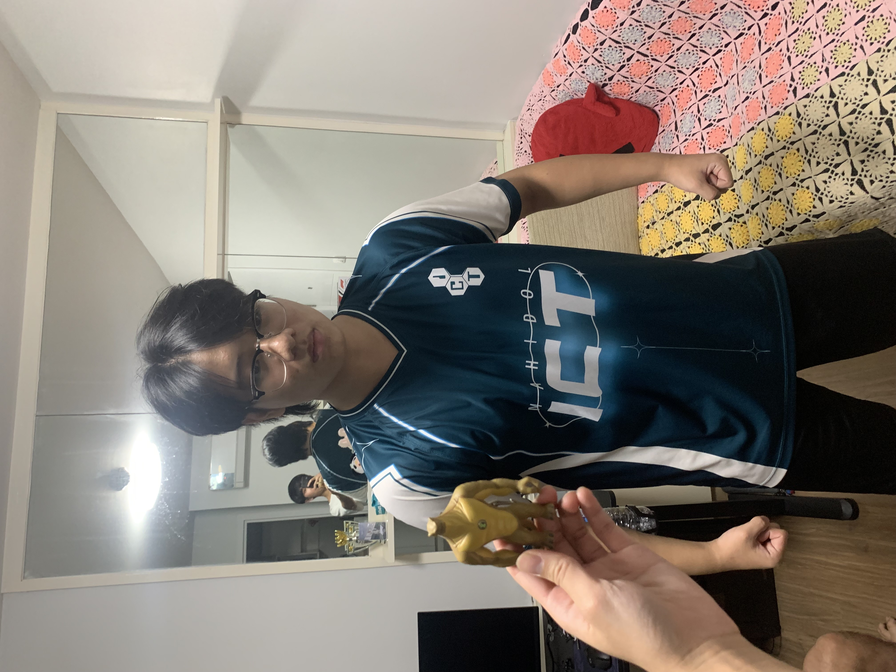

# GoonShop 🛒❄️

**GoonShop** is a full-stack web application for a Frozen Food Retail business. It serves as a comprehensive catalog and management system for various frozen food products, including raw meats, poultry, seafood, and ready-to-eat meals.

# Link Test Prototype:
**Extra Score**
https://kritsakornn.github.io/Sec1-Gr02-PJ2-web/

## 🌟 Features
- **Product Catalog**: Browse a wide variety of frozen food products.
- **Search & Filter**: Find products easily by name, brand, price range, or ingredients.
- **Admin Dashboard**: Secure login for administrators to manage inventory.
- **Product Management**: Create, Read, Update, and Delete (CRUD) operations for products.
- **Responsive Design**: Beautiful UI built with HTML/CSS/JS that works seamlessly across devices.

## 🚀 Technologies Used
- **Frontend**: HTML5, CSS3, Vanilla JavaScript
- **Backend API**: Node.js, Express.js
- **Database**: MySQL
- **Deployment**:
  - Frontend hosted on **GitHub Pages**
  - Backend API hosted on **map.longdo.com**

## 👥 Meet the Team (Section 1, Group 02)

| Photo | Name | Student ID | Role |
| :---: | :--- | :---: | :--- |
|  | **Chutchanun Jirapapongpun** | 6788027 | Frontend / Design |
|  | **Napat Tayommai** | 6788127 | Frontend / Backend |
|  | **Kritsakorn Thammas** | 6788129 | Backend / Design |
|  | **Thanapat Wongthongtham** | 6788145 | Frontend / Database |
|  | **Tantikorn Lapkloyma** | 6788241 | Report / Reviewer |

## 📦 Project Structure
- `/sec1_gr02_fe_src`: Frontend source code (HTML, CSS, JS, Images)
- `/sec1_gr02_ws_src`: Backend API source code (Node.js, Express)
- `sec1_gr02_database.sql`: Database schema and initial data

## ⚙️ How to Run Locally

## 1. Download the Project
1. Clone the project using the git url:
   ```bash
   git clone https://github.com/GoonNapat6788127/ProjectWeb.git
   ```

### 2. Backend Setup
1. Open your terminal and navigate to the backend folder:
   ```bash
   cd sec1_gr02_ws_src
   ```
2. Install dependencies:
   ```bash
   npm install
   ```
3. Run the server:
   ```bash
   npm start
   ```

### 3. Frontend Setup
1. Open your terminal and navigate to the fontend folder:
   ```bash
   cd sec1_gr02_fe_src
   ```
2. Install dependecies:
   ```bash
   npm install
   ```
3. Run the server:
   ```bash
   npm start
   ```
4. Click the link example -> [http:localhost:xxxx](http://localhost:xxxx)

## 🖱️ Website Navigation Guide

### 1. Home Page (Explore & Discover)
*   **Hero Sections**: Browse through various categories like Premium, Fresh, and Quality frozen goods.
*   **Store Location**: Find us on the map! Click the **"Get Store Location"** button to automatically center the map on our Salaya branch.

### 2. Searching for Products
*   **Search**: Click the search icon or bar in the header to open the Advanced Search Overlay.
*   **SearchCategories**: Narrow down your choices by entering a **Price Range**, searching for a specific **Brand**, or selecting an **Ingredient** (Chicken, Beef, Fish, etc.) must select three criterias. Click **"Search"** to view results.

### 3. Product Catalog
*   **Navigation**: Click **"Product"** in the main menu to see the full grid of items.
*   **Details**: Click on any product card to view its full details, including a high-quality image, price, and specific ingredients.

### 4. Admin Portal (For Staff Only)
*   **Login**: Click the **User/Admin Icon** in the header to access the Admin Login page.
*   **Management Dashboard**: Once logged in, admins can:
    *   **Add Product**: Insert new items with name, price, brand, and image URL.
    *   **Edit/Delete**: Update existing product information or remove items from the catalog.
*   **Admin Logs**: Track admin history login in logs section.

### 5. Team Information
*   Visit the **"Team"** page to meet the creators behind GoonShop and learn about our project roles.
